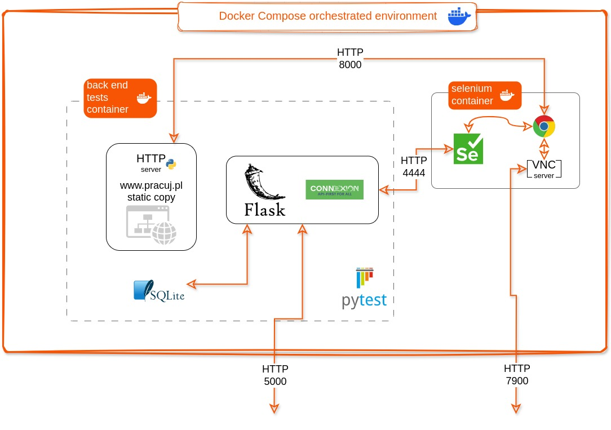

# Job Tracker

A full stack project using Flask, Selenium, Pytest, Docker, ...., and whatnot.

## Table of contents

- [What it is and what it is not](#what-it-is-and-what-it-is-not)
- [Structure](#structure)
- [How to install](#how-to-install)
- [How to run](#how-to-run)
- [Development](#development)

## What it is and what it is not

Job Tracker is a web application split into two main components: a back end headless service and a front end service responsible for the UI. The front end communicates with the back end using the RESTful API exposed by the later.

The back end application periodically collects information about a small subset of job offers posted on one popular portal and stores that information in an external database. The front end, being by design a completely independent app, then processes the collected data and displays it in a form of a histogram, additionally allowing to browse offers list and go to the original postings.
Both apps and supporting services are build as Docker containers and launched into a Docker Compose environment allowing for their interaction. The code is accompanied by a suit of tests that can be run from the developer's local environment and/or launched as a step during container creation process.

This application was build for training purposes and should be treated as such. Although the project is reasonably well structured this is not a production ready code. Some parts are still missing, some choices made for the stated purpose expose parts of the program that should not be exposed.... consider yourself warned.

## Structure

Below is a high level overview of the parts that make up the project and how they interact.

<div align="center">
    
</div>

### Back end app

This application consist of 3 key components a [Flask](https://flask.palletsprojects.com/) base application, [Selenium](https://www.selenium.dev/) library and [Connexion](https://pypi.org/project/connexion/) framework.

In essence it is a web scraper. The core Flask app periodically looks for job offers on the www.pracuj.pl website and collects those meeting a predefined criteria. To navigate the website and find interesting information it uses, defined internally, Page Object Model (POM) build with python bindings for the Selenium WebDriver (usage of Selenium was one of the gaols of this project although the author is fully aware that this could have been done in a less involved way). Collected data are then stored in a SQL database. Database operation are performed using SQLAlchemy.

To make stored information available for the front end the app defines a few RESTful API endpoints. The API itself is first defined following the [OpenAPI/Swagger](https://swagger.io/specification/) specification. It is then implemented with [Connexion](https://pypi.org/project/connexion/), that plugs into the main Flask application as a components responsible for handling requests coming to the endpoints. Additional Connexion module provides so called Swagger UI - a web interface allowing for requests to the API endpoints be made manually from the browser for test and validation purposes. Other then that the back end app does not have a UI.

Every Flask app comes with its own WSGI application server that can handle http requests directly but since it is designed solely for development purposes in the Docker environment a dedicated WSGI server, [Gunicorn](https://gunicorn.org/) is setup to do this job.

### Front end app

This application is also built using Flask that is used to create a set of dynamic webpages based on HTML templates and CSS. Server side of this app is making request to the back end API and displays the results (that is to say the client side, web browser code is not making API calls by itself). The part of the app that is responsible for generating a histogram is implemented using [Dash](https://dash.plotly.com/).

Similarly to the back end service in Docker environment this app is served by [Gunicorn](https://gunicorn.org/).

### Selenium service

Since the back end needs Selenium for web browser automation a separate Docker container is set up to deliver that capability. This service consists of a Selenium controlling server, responsible for handling http request for browser operations to performed and Chrome browser that stays under the control of said server. This container also comes with a minimal installation of X11 server, allowing Chrome to run with its UI and a VNC server which allows remote access to the running X session (eg. from the host machine) which makes it possible to observe whatever operations the browser is performing live. This is especially useful during testing of the POM but this configuration is also used for normal operation of the back end when it makes request to the pracuj.pl website. Again this is for demonstration purposes as for normal operation, to save resources, it would be more sensible to set up a container without X11 and VNC and run Chrome in headless mode, a feature also supported by Selenium.

### Database service

Finally the last needed service is a database in which the back end stores collected information. This a Mariadb SQL server which has it's storage directory linked to a directory on the host computer for data persistence.

### "Dockerization"

The whole suite of containers is orchestrated through Docker Compose. Back end and Front end images are defined in Dockerfile's in their subdirectories. The way all container should be started, in what order, which ports should be exposed and passed as environment variables for other containers to be able to connect to those services is defined in the `job-tracker-compose.yaml` file in the top level directory. The compose file makes use of profiles defining normal "production" environment and "test" environment.

For convenience there are 3 Makefiles that gather some frequently used commands used during development, testing and running of the apps.

## How to install

### Dependencies

In order to install the application on your machine you need:

- Docker
- Python >= 3.11
- make - this is not a strict requirement but makes things easier (if you don't have it, look into the Makefile and execute commands found there directly)

### Installation

Simply clone this repository and go into project's directory

```bash
git clone https://github.com/programB/job_tracker.git
cd job_tracker 
```

## How to run

### Full application

In order to see the application "in action" do:

```bash
make apps
```

You will see all Docker images getting build and when this process finishes and all containers start your browser should automatically open front end's home page. Go ahead and see how it works. By default the back end app will load some demo data into the database so the front end has something to show.

If you want you can also connect to the individual containerised services as their ports are exposed to your host machine (this is BTW one of the things that shouldn't be done in a real production environment). See the diagrams in [Structure](#structure) for port numbers.

### Tests

All tests are implemented with [Pytest](https://pytest.org/) framework.
To see them being executed do:

```
make tests && make tests.backend.monitor && make tests.backend.logs
```

This will start image build process similar to the one described above but this time Docker output will be more verbose and you will see unit tests and static code analysis running during build. Once this is successfully completed your browser will be directed to the VNC server in the Selenium container and your console will show the logs of the back end service. In this step you will be able to see database tests and live browser tests of the target's website POM.

The tests that require Selenium are performed in slightly different configuration of Docker containers. Eg. instead of regular back end service a back end test service is spun up. Instead of Selenium making connections to the real website the test code starts a temporary Http server and redirects Selenium to use it instead. Then it makes all tests against a stored, partial copy of the target website. For the time being also the database operations are not performed using the database service but instead the test code substitutes it with a SQLite database. This is done for test functions installation as such a database can be easily discarded all together and recreated very quickly.

<div align="center">
    
</div>

### Turning it off

You can stop and remove all **containers** by doing

```bash
make down
```

If you want to remove the **images** you do it manually by listing all of them:

```bash
docker images
```

and removing those that are not needed:

```bash
docker rmi <image ID>
```

Finally the database service creates a `db_storage_dir` directory for data persistence. You can remove it when not needed but you will obviously loose the collected data as well (with the exception of the demo data that come with and can be loaded by the back end app).

## Development

Both components share the same repository for ease of deployment. When it comes to development however each app is meant to be worked on in its own isolated virtual environment. Apps subdirectories come with their own Makefile's that make it easy to set-up such an environment. Both apps define their metadata in `pyprojec.toml` files and use `constraints.txt` file to pin the dependencies to a specific version. This way one can reproduce the environment the application was developed in. This reduces the risk of things falling apart due to new versions not working with each other the way they used to.

Example.

To work on the back end app start by going to its directory

```bash
cd back_end
```

Then create a new virtual environment and activate it like this:

```bash
make local.initialize.environment
source ./venv/bin/activate
```

(the activation instruction assumes you are using `bash`)

Finally install the application into the environment together with its dependencies - both needed at runtime and in development process:

```
make local.setup.environment
```

Any changes to the source code are immediately visible by the python's import system since the packages is installed in the `editable` mode. This allows for the test code to reside in a separate directory that will not be included in the final application package (python wheel). The test code can of course still be included in the Docker image.

To run unit tests during development and in a local environment do:

```
make local.test.unit
```

If new dependencies are added to `pyproject.toml` run again:

```
make local.setup.environment
```

to install them (packages already installed will not be affected). It is also a good idea to pin the versions of those new dependencies in the `constraints.txt` file. To do that run:

```
make local.update.constraints
```

If one wishes to update some of the dependencies this can be achieved by running `pip` like so:

```
pip install --upgrade <name_of_the_dependency_to_upgrade>
```

and then updating the constraints file

```
make local.update.constraints
```
